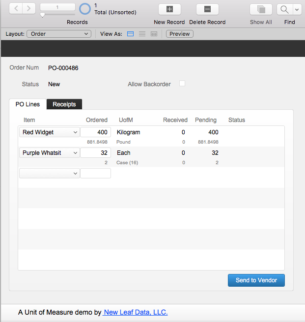

There are times in an Inventory Management System that an item will need to be viewed in multiple units of measure.  One example is when an item is counted (or sold) in one unit but purchased in another. This demo file illustrates one approach to solving the multiple unit quandary.

*The download link for this file is sent via email after submitting the "Updates and Downloads" form.  If you didn't receive that welcome email, please let me know at daniel@newleafdata.com*
