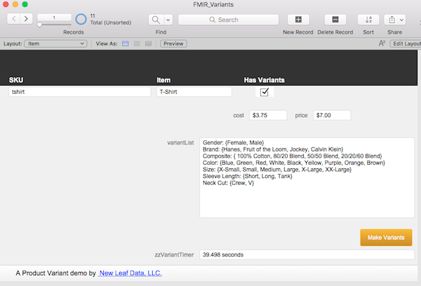

# Variant

This file demonstrates one way to create variants from a master product.  Create an item and mark the checkbox Has Variants.  In the Variant List field list all the variants in the following naming convention:

Variant 1: {Option 1, Option 2, Option 3, etc.}
Variant 2: {Option 1, Option 2, Option 3, etc.}
Variant 3: {Option 1, Option 2, Option 3, etc.}

For example, 
Color: {Blue, Black, Orange}
Size: {Large, Small}

You can have as many options inside a set as you like (a set is defined by the  curly braces “{}” ).

You can have as many variants as you like.

If you’ve signed up to be notified of new articles and downloads, then you should have received an email with the download link.  If you haven’t, please contact me.  If you’ve not yet signed up for notifications/newsletters, fill out that form on the home page and you’ll receive the download link for all the files in the welcome email.

If you have any questions, please contact me at daniel@newleafdata.com

Thanks.

#FMIR
